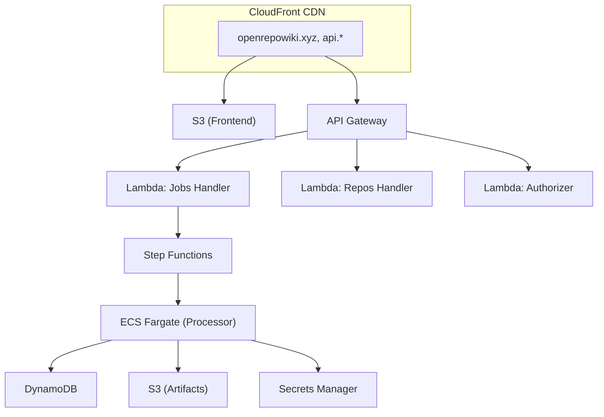

# OpenRepoWiki


**OpenRepoWiki** 能够为任意 GitHub/GitLab 仓库自动生成完整的 wiki 式文档。无需逐个翻阅海量代码文件,即可快速了解每个文件和文件夹的作用。

**在线演示:** [openrepowiki.xyz](https://openrepowiki.xyz)

## ✨ 功能特性

- **自动生成 Wiki:** 为仓库的用途、功能和架构生成详细摘要
- **代码库分析:** 识别关键文件、函数及其在项目中的作用
- **依赖关系图:** 使用 Mermaid 图可视化文件之间的关系
- **代码块链接:** 高亮的代码块直接链接到源码所在行

## 🏗️ 架构

当前分支(`aws-main`)运行在完全无服务器(Serverless)的 AWS 基础设施上:



### 组件说明

| 组件 | 说明 |
|-----------|-------------|
| **CloudFront** | CDN,支持自定义域名与 SSL 终止 |
| **S3** | 前端静态托管 + 产物(artifact)存储 |
| **API Gateway** | REST API,带 Lambda 授权器与 WAF 防护 |
| **Lambda** | API 处理函数(jobs、repos)与请求授权器 |
| **Step Functions** | 编排仓库处理工作流 |
| **ECS Fargate** | 运行基于 LLM 的代码摘要任务 |
| **DynamoDB** | 存储仓库数据、任务状态与摘要 |
| **WAF** | 限流、机器人防护、IP 过滤 |

## 📁 项目结构

```
openrepowiki3/
├── frontend/               # React + Vite 前端
│   └── src/
│       ├── api/            # 带请求签名的 API 客户端
│       └── components/     # React 组件
├── services/
│   ├── api/                # Lambda API 处理函数
│   │   └── handlers/       # Jobs、Repos、Authorizer
│   └── processor/          # 用于处理的 ECS 容器
├── shared/                 # 共享工具库
│   ├── github/             # GitHub API 客户端
│   ├── gitlab/             # GitLab API 客户端(接口兼容)
│   ├── source.py           # 源码提供方工厂(GitHub | GitLab)
│   └── storage/            # DynamoDB + S3 客户端
├── infra/
│   └── terraform/
│       ├── modules/        # 可复用的 Terraform 模块
│       │   ├── apigw/      # API Gateway + 授权器
│       │   ├── cloudfront/ # CDN 配置
│       │   ├── dynamodb/   # 数据库表
│       │   ├── ecs/        # Fargate 集群 + 任务
│       │   ├── lambda/     # Lambda 函数
│       │   ├── sfn/        # Step Functions
│       │   ├── vpc/        # VPC + 网络
│       │   └── waf/        # Web 应用防火墙
│       └── env/prod/       # 生产环境配置
├── local/                  # 本地开发栈(Docker + LocalStack)
├── docker-compose.yml      # 本地开发:LocalStack + API + 处理器
└── docs/                   # 需求与文档
```

## 🧑‍💻 本地开发(Docker + LocalStack)

**无需 AWS 账号**即可在本机运行整个后端。AWS 服务由 [LocalStack](https://localstack.cloud) 模拟(DynamoDB + S3);Step Functions / ECS 编排则改为直接运行处理器。

```bash
# 1. 配置 —— 密钥写入被 git 忽略的 local/.env.local
cp local/.env.local.example local/.env.local
#    设置源码 token(GITHUB_TOKEN 或 GITLAB_TOKEN)及可选的 LLM_* 密钥

# 2. 启动 LocalStack + API  (http://localhost:8000)
docker compose up -d

# 3. 处理一个仓库  (拉取 -> 过滤 -> 摘要 -> 存储)
./local/process-repo.sh <owner> <repo> [branch]

# 4. 浏览结果
curl 'http://localhost:8000/repos/<owner>/<repo>/tree?branch=<branch>'
```

把前端指向它:`VITE_API_URL=http://localhost:8000`。完整步骤、排障以及各组件与 AWS 的对应关系,详见 [local/README.md](local/README.md)。

> 仅需安装 `docker`(无需 AWS CLI / Terraform)。LocalStack 数据为内存态,执行 `docker compose down` 后清空。

## 🔌 源码提供方(GitHub 与 GitLab)

仓库可从 **GitHub 或 GitLab** 读取(均支持私有库及自建 GitLab)。通过处理器的 `REPO_PROVIDER` 环境变量选择提供方:

| 配置项 | GitHub | GitLab |
|---------|--------|--------|
| `REPO_PROVIDER` | `github`(默认) | `gitlab` |
| Token | `GITHUB_TOKEN`(私有库需 `repo` 权限) | `GITLAB_TOKEN`(权限 `read_api`、`read_repository`) |
| `GITLAB_URL` | — | 自建实例的基础 URL(默认 `https://gitlab.com`) |

生成的代码链接会自动使用正确的主机与格式(GitHub 为 `/blob/`,GitLab 为 `/-/blob/`)。对于 GitLab **嵌套组**,将最外层 group 作为 `owner`,其余路径作为 `repo` 传入(例如 `./local/process-repo.sh mygroup subgroup/project`)。

实现位置:`shared/source.py`(工厂)在 `shared/github/` 与 `shared/gitlab/` 之间选择;两者暴露相同的客户端接口。

## 🚀 生产部署(AWS)

### 前置条件

- 已配置好相应权限的 AWS CLI
- Terraform v1.5+
- Node.js 18+
- Python 3.11+
- 用于构建 ECS 容器的 Docker

### 1. 配置环境变量

```bash
# 复制并配置环境变量
cp .env.example .env

# 必需变量:
# - REPO_PROVIDER (github | gitlab)
# - GITHUB_TOKEN   (或 GITLAB_TOKEN,自建 GitLab 还需 GITLAB_URL)
# - LLM_PROVIDER (deepseek | openrouter)
# - LLM_APIKEY
```

### 2. 部署基础设施

```bash
cd infra/terraform/env/prod

# 初始化 Terraform
terraform init

# 预览变更
terraform plan

# 应用基础设施
terraform apply
```

### 3. 构建并部署 Lambda

```bash
cd services/api
./build_package.sh

# 上传到 Lambda(通过 Terraform 或 AWS CLI)
aws lambda update-function-code \
  --function-name openrepowiki-prod-jobs-handler \
  --zip-file fileb://dist/api-lambda-package.zip
```

### 4. 构建并部署前端

```bash
cd frontend

# 设置生产环境 API 地址
export VITE_API_URL=https://api.openrepowiki.xyz/v1
export VITE_SIGNING_KEY=your-signing-key

npm install
npm run build:prod

# 同步到 S3
aws s3 sync dist/ s3://openrepowiki-prod-frontend/
```

## 🔒 安全

本部署包含多层安全防护:

| 层级 | 防护措施 |
|-------|------------|
| **WAF** | 限流、AWS 托管规则、机器人检测 |
| **Lambda 授权器** | 对 POST 接口进行 HMAC 签名校验 |
| **CORS** | 仅允许 openrepowiki.xyz 来源 |
| **VPC** | ECS 置于私有子网,使用 VPC 端点 |
| **Secrets Manager** | 安全存储 API 密钥与签名密钥 |

## 📊 监控

- **CloudWatch 日志:** 所有 Lambda、ECS 与 API Gateway 日志
- **CloudWatch 指标:** 请求量、延迟、错误数
- **WAF 日志:** 被拦截的请求、触发限流的记录

## 💰 成本优化

本架构以成本效益为设计目标:

- **Lambda:** 按调用计费,无闲置成本
- **Fargate Spot:** 处理任务最高节省 70%
- **DynamoDB 按需:** 按请求计费
- **CloudFront:** 全球缓存静态资源

## 📖 文档

- [本地开发指南](local/README.md)
- [需求与用例](docs/README.md)
- [API 文档](services/api/README.md)
- [前端指南](frontend/README.md)

## ⚠️ Token 用量警告

> [!CAUTION]
> 分析大型仓库每个可能消耗 **100 万+ 输入/输出 token**。生产环境请使用 DeepSeek 等高性价比的 LLM 提供方。
